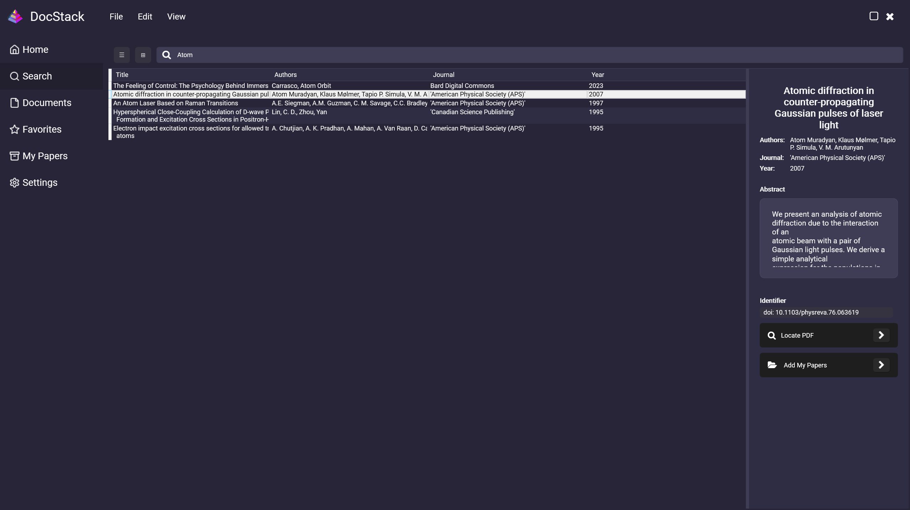
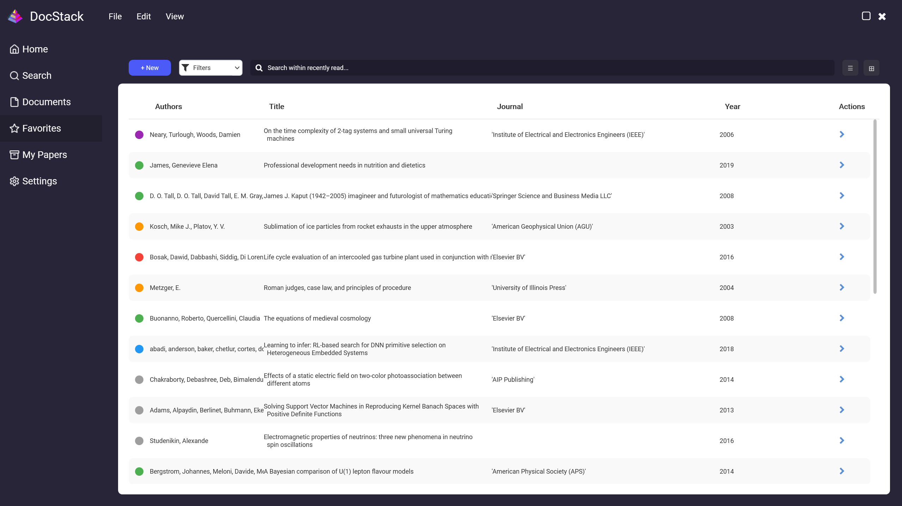

# DocStack - Smart Document Management Solution

<div align="center">
  
</div>

## Overview
DocStack is a modern, user-friendly document management system designed to help researchers, professionals, and organizations efficiently organize and access their documents. With its intuitive interface and powerful features, DocStack transforms the way you handle your document collection.

## 🌟 Key Features

### 1. Centralized Document Management
<div align="center">
  
</div>

- Store all your PDFs, documents, and papers in one organized location
- Easy access to your entire document collection
- Streamlined file organization system

### 2. User-Friendly Interface
<div align="center">
  
</div>

- Clean, modern design
- Intuitive navigation
- Responsive layout that works on all devices
- Familiar interface for quick adoption

### 3. Smart Organization
- Efficient document categorization
- Quick access to frequently used documents
- Seamless integration of external sources

## 🛠️ Technical Stack

### Frontend
- HTML5
- CSS3 (with modern flexbox and grid layouts)
- JavaScript (Vanilla JS)
- Responsive Design
- Custom SVG icons and animations

### Design
- Modern UI/UX principles
- Inter & Roboto fonts for optimal readability
- Carefully crafted color scheme
- Smooth animations and transitions

## 📁 Project Structure

```
DocStack/
├── css/                 # Stylesheet files
│   ├── styles.css      # Main styles
│   ├── layout.css      # Layout specific styles
│   └── components.css  # Component specific styles
├── js/                 # JavaScript files
│   ├── main.js        # Main application logic
│   └── modal.js       # Modal functionality
├── Images/            # Image assets
├── Resources/         # Additional resources
└── index.html        # Main HTML file
```

## 🚀 Getting Started

1. Clone the repository:
   ```bash
   git clone https://github.com/EXDEICIDA/DocStack.git
   ```

2. Open `index.html` in your web browser to start using DocStack.

## 💻 Browser Compatibility

DocStack is compatible with all modern browsers:
- Google Chrome (recommended)
- Mozilla Firefox
- Microsoft Edge
- Safari

## 🎯 Target Audience

- Researchers
- Academic professionals
- Organizations
- Anyone who needs efficient document management

## 🤝 Contributing

We welcome contributions! If you'd like to contribute:
1. Fork the repository
2. Create your feature branch
3. Commit your changes
4. Push to the branch
5. Create a Pull Request

## 📄 License

This project is open source and available under the MIT License.

## 📞 Support

For support, please:
- Open an issue on GitHub
- Contact us through our website
- Join our community forum

## 🔮 Future Plans

- Advanced search functionality
- Cloud integration
- Collaborative features
- Mobile application
- AI-powered document analysis

---

<div align="center">
  
  <p>Made with ❤️ by DocStack</p>
</div>
